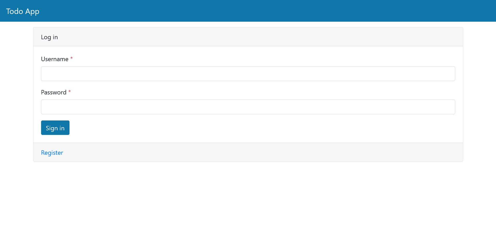

<div align="center">

# TodoApp Pet Project

**A modern, full-stack Task Management System built with FastAPI.**

[](https://www.python.org/)
[](https://fastapi.tiangolo.com/)
[](https://developer.mozilla.org/docs/Web/JavaScript)
[](https://jquery.com)
[](https://getbootstrap.com)
[](https://www.sqlite.org/)
[](https://www.sqlalchemy.org)
[](https://docs.pydantic.dev/)
[](https://docs.astral.sh/uv/)
[](https://jwt.io/)
[](https://docs.pytest.org)
[](https://www.docker.com/)
[](https://haveibeenpwned.com/)

[Overview](#-overview) • [Key Features](#-key-features) • [Tech Stack](#-tech-stack) • [Getting Started](#-getting-started) • [API Docs](#-api-documentation)
</div>

---

## 📖 Overview

TodoApp Pet Project designed to showcase modern web development practices.

The following learning resources (among others) were used to build the application:

- [Python Developer Course](https://www.udemy.com/course/complete-python-developer-zero-to-mastery) — main source of my
  Python knowledge and skills.
- [FastAPI Course](https://www.udemy.com/course/fastapi-the-complete-course/) — My main course for learning FastAPI and
  a project [blueprint](https://github.com/codingwithroby/FastAPI-The-Complete-Course).
- [Database Course](https://www.udemy.com/course/complete-sql-databases-bootcamp-zero-to-mastery/)
- [Docker Course](https://www.udemy.com/course/learn-docker/)

> The frontend (static) for my project was copied from
> the [FastAPI Course](https://www.udemy.com/course/fastapi-the-complete-course/) with only minor changes.

---

## ✨ Key Features

| Feature                       | Detailed Description                                                                                                                                  |
|:------------------------------|:------------------------------------------------------------------------------------------------------------------------------------------------------|
| **🏗️ 3-Tier Architecture**   | Structured with a clear separation of concerns between the presentation layer, buisness logic layer (Services), and data layer (Database and Models). |
| **🔑 Secure Authentication**  | Registration and login system utilizing *OAuth2* and *JWT* (JSON Web Tokens) for session management.                                                  |
| **🔒 Data Protection**        | Strong password hashing using *bcrypt*.                                                                                                               |
| **🛡️ Password Safety**       | *Have I Been Pwned* API powered breach detection.                                                                                                     |
| **📝 Task Management**        | Full CRUD operations for personal todo lists.                                                                                                         |
| **💼 Administrative Control** | Dedicated backend administrative endpoints for todo management.                                                                                       |
| **🪪 User Profiles**          | Backend endpoint for personalized user profile editing.                                                                                               |
| **💾 Reliable Data Storage**  | Persistent storage using *SQLite* with *SQLAlchemy* ORM.                                                                                              |
| **🔄️ Automated Migrations**  | Database schema changes using *Alembic*.                                                                                                              |
| **🔍 Data Validation**        | *Pydantic* models for strict data validation.                                                                                                         |
| **🧪 Automated Testing**      | Unit and integration tests using *Pytest*                                                                                                             |
| **⚙️ CI/CD Automation**      | Run automated tests with every push using *GitHub Actions*                                                                                                      |
| **🐋 Container Deployment**   | Containerized using *Docker*, Ready-To-Go development and production environment.                                                                     |
| **🎨 Modern Responsive UI**   | User-friendly GUI built with *Jinja2* templates, styled with *Bootstrap 5*, and enhanced with *jQuery*.                                               |
| **📂 Structured API**         | Well-organized API endpoints with automatic documentation (*Swagger*/*Redoc*).                                                                        |

---

## 🛠️ Tech Stack

<details open>
<summary><b>Backend & Database</b></summary>

- **Language:** [Python](https://www.python.org/) 3.14
- **Web Framework:** [FastAPI](https://fastapi.tiangolo.com/) 0.124.4
- **Database:** [SQLite](https://www.sqlite.org/)
- **ORM:** [SQLAlchemy](https://www.sqlalchemy.org/) 2.0.45
- **Migrations:** [Alembic](https://alembic.sqlalchemy.org/) 1.17.2
- **Data Validation:** [Pydantic](https://docs.pydantic.dev/) 2.12.5
- **Security:** [Python-jose](https://python-jose.readthedocs.io/) (JWT)
  3.5.0, [Passlib](https://passlib.readthedocs.io/) 1.7.4 (
  bcrypt 4.0.1), [Have I Been Pwned](https://haveibeenpwned.com/) (breach detection).

</details>

<details open>
<summary><b>Frontend & UI</b></summary>

- **Templating:** [Jinja2](https://jinja.palletsprojects.com/) 3.1.6
- **Styling:** [Bootstrap 5](https://getbootstrap.com/)
- **Interactivity:** [jQuery](https://jquery.com/)

</details>

<details open>
<summary><b>DevOps & Tools</b></summary>

- **Package Manager:** [uv](https://docs.astral.sh/uv) 0.9.17
- **Testing:** [Pytest](https://docs.pytest.org/) 9.0.2
- **CI/CD:** [GitHub Actions](https://github.com/features/actions)
- **Containerization:** [Docker](https://www.docker.com/)

</details>

---

## 📸 Preview

<p align="center">
  
  <br>
  <em>The application main window showcasing the task list.</em>
</p>

---

## 🚀 Getting Started

### Prerequisites

- **[Python](https://www.python.org/) 3.14+**
- **[uv](https://docs.astral.sh/uv)** (recommended) or pip
- **[Docker](https://www.docker.com/)** (optional)

### Installation & Setup

Two options:

#### Option 1 — Local installation

1. **Clone the repository and enter the project directory:**
   ```bash
   git clone https://github.com/MaxKtzv/TodoAppPetProject.git
   cd TodoAppPetProject
   ```

2. **Install Dependencies:**

   With `uv` (recommended):
   ```bash
   uv sync
   ```
   Or with `pip`:
   ```bash
   pip install -r requirements.txt
   ```

3. **Launch the App:**

   If using `uv`:
   ```bash
   uv run uvicorn main:app
   ```

   Or directly with `uvicorn`:
   ```bash
   uvicorn main:app
   ```

#### Option 2 — Docker

1. **Clone the repository and enter the project directory (same as above).**

2. **Build and run container with Docker Compose:**
   ```bash
   docker compose up --build
   ```

The application will be accessible at: **[http://127.0.0.1:8000](http://127.0.0.1:8000)**

> **Notes**:
> - For local installs, pip is included with Python; install uv if you prefer using its commands.
> - Inside the container, uv is preinstalled — use uv commands there.
---

## 🧪 Running Tests

Ensure the quality and stability of the application by running the full test suite:

If using `uv`:

```bash
uv run pytest  # Run all tests
```

Or directly:

```bash
pytest
```

---

## 📂 Project Structure

```text
TodoAppPetProject/
├── alembic/              # Database migration scripts and configuration
├── dependencies/         # FastAPI dependency injection (DB sessions, auth)
├── models/               # SQLAlchemy ORM database models
├── routers/              # API endpoint definitions and UI route controllers
├── schemas/              # Pydantic models for request/response validation
├── security/             # Security utilities (JWT handling, password hashing, breach checks)
├── services/             # Core business logic layer (separates logic from routes)
├── static/               # Static assets (CSS, JavaScript, images)
├── templates/            # Jinja2 HTML templates for the frontend
├── test/                 # Automated unit and integration tests
├── main.py               # Application entry point and configuration
├── pyproject.toml        # Project metadata and dependency definitions
├── requirements.txt      # Python package dependencies
└── compose.yaml          # Docker Compose configuration
```

---

## 📖 API Documentation

The API is fully documented and can be explored interactively:

- **Swagger UI:** [http://127.0.0.1:8000/docs](http://127.0.0.1:8000/docs) - Interactive API testing.
- **Redoc:** [http://127.0.0.1:8000/redoc](http://127.0.0.1:8000/redoc) - Clean, detailed documentation.

---

## ✅ Roadmap & Next Steps

- [ ] **Async Support:** Fully transition the database layer to use asynchronous SQLAlchemy.
- [ ] **UI Enhancements:** Implement GUI for managing user profiles and administrative tasks.
